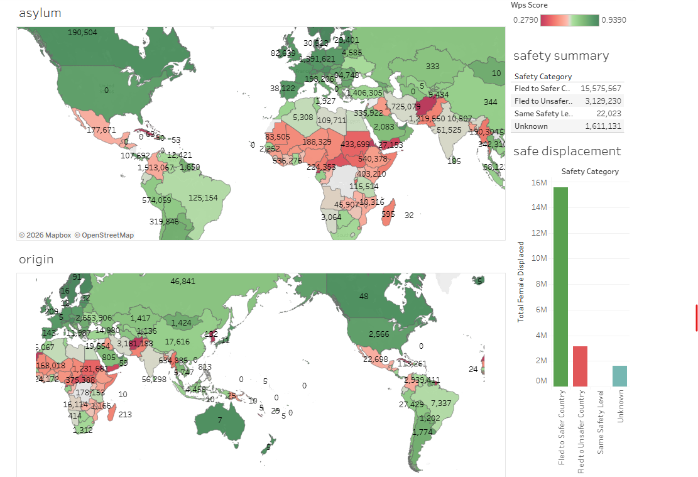

# WPS-UNHCR-Map: Global Women's Displacement & Safety Analysis

A geospatial and data-driven study on migration focusing on women's safety. 

This is my first complete data analysis project! I analyzed global data from the UNHCR to track exactly where displaced women are fleeing from and where they are arriving. To add depth to this study, I integrated the Women, Peace, and Security (WPS) Index from the Georgetown Institute to investigate a critical question: **Are displaced women successfully reaching safer countries?**

I used SQL (Google BigQuery) to gather, clean, and integrate the datasets, and Tableau to engineer an interactive visualization dashboard.

---

## 🛠️ Tech Stack & Tools
* **SQL (Google BigQuery):** Advanced data extraction, multi-table joins, and data cleaning.
* **Tableau:** Interactive geospatial mapping and KPI dashboarding.
* **Google Sheets:** Data cleaning and creation of a dictionary

---

## 🧹 Data Cleaning & Technical Challenges (The Messy Part)
Before running the final analysis, the raw WPS Index dataset required significant data engineering to make it readable and compatible with BigQuery:

* **Handling Structural Inconsistencies:** Removed broken headers, blank trailing rows, and metadata footnotes that disrupted table schemas during ingestion.
* **Resolving Name Mismatches:** I utilized a `FULL OUTER JOIN` filtered by `WHERE ... IS NULL` to deliberately expose mismatching country names between the UNHCR and WPS datasets. This diagnostic step allowed me to manually clean and standardize variant country listings (e.g., standardizing regional variations).

---

## 💡 Key Analytical Insights

* **The Scale of Global Female Displacement:** The final dataset accounts for **20,337,951** displaced women globally. Top fleeing country was Afghanistan, with **3,181,188** women leaving, **15.6%** of the total.
* **Migration to Safety:** **76.6%** of the women in this study successfully arrived in countries with a higher WPS safety score than their country of origin.
* **The Major Corridors (Top 4 Displacement Flows):**
  1. **Afghanistan to Iran:** 1.71 million women fled to Iran, moving to a significantly higher WPS safety score (`0.279` to `0.608`).
  2. **Venezuela to Colombia:** 1.51 million women migrated to Colombia, despite Colombia having a lower WPS safety score than Venezuela (`0.638` to `0.551`).
  3. **Syria to Türkiye:** 1.40 million women fled to Türkiye, marking a substantial increase in regional safety index score (`0.364` to `0.664`).
  4. **Afghanistan to Pakistan:** 1.21 million women fled to Pakistan, escaping extreme crisis despite Pakistan's lower WPS score (`0.279` to `0.462`).

---

## 📊 Project Artifacts & Links
* **Interactive Visualization:** [Check the maps with the WPS index and number of migrants](https://public.tableau.com/app/profile/camila.lima2515/viz/Mappingwomenssafety/Dashboard1)
* **Data Pipeline Code:** files 01 and 02 of this repository.
* **Datasets:** [raw data from UNHCR](persons_of_concern_demographics.csv)
                [raw data from Georgetown institute](WPS-Index-2025-Data.xlsx)
                [clean version of the Georgetown Institute data](WPS-Index-2025-Data - TABLE 1 clean.csv)
                [dicitionary](country_name_mapping.csv)
                [final table](`bq-results-20260618-152412-1781800721548.csv`)

---

## 📸 Dashboard Preview

